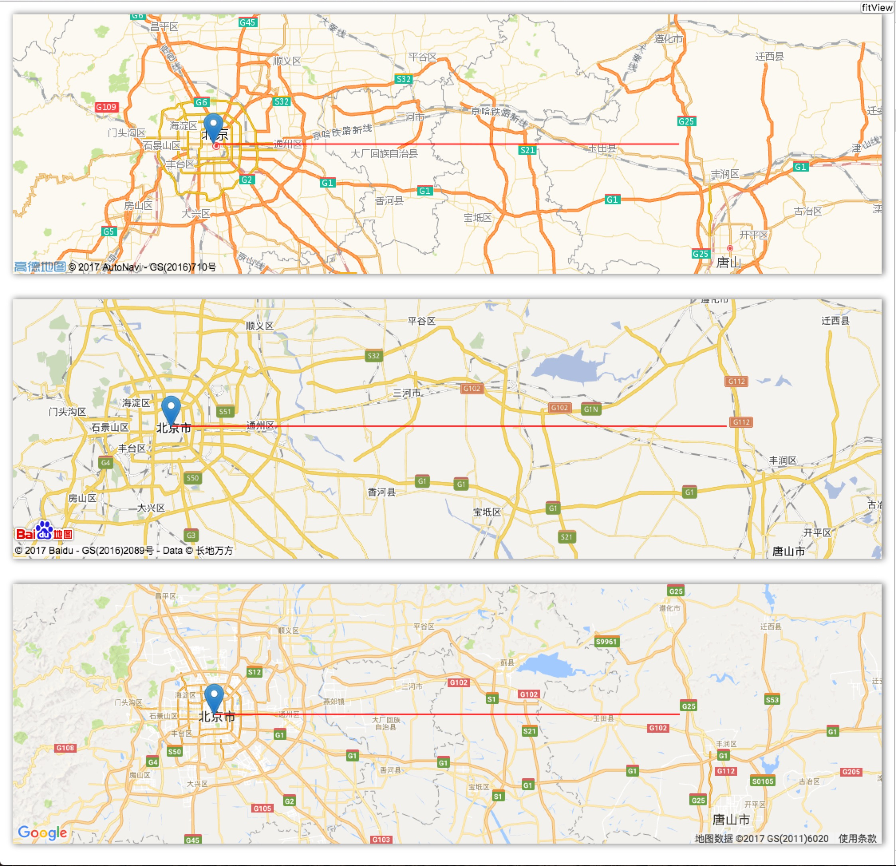

使用相同的代码创建你的 web 地图应用。

# Feature
1. Layers
    1. Marker
    2. Polyline
2. Map Controls
    1. zoom
    2. fitView
    3. panTo
3. Evented
4. Utils
    1. getBound
    2. locate
    3. coordinate translate

# Usage

## Install
`npm install plain-js`

## Create map
```javascript
var plain = new Plain();
plain._v.setCoordType('GCJ02');
plain.use('GMAP');          // GMAP, AMAP, BMAP
var p = {
    lat: 39.908012,
    lng: 116.399348,
};
var map = plain.Map({
    container: "#map",          // DivElement
    center: [p.lat, p.lng],
    zoom: 15
});
```


