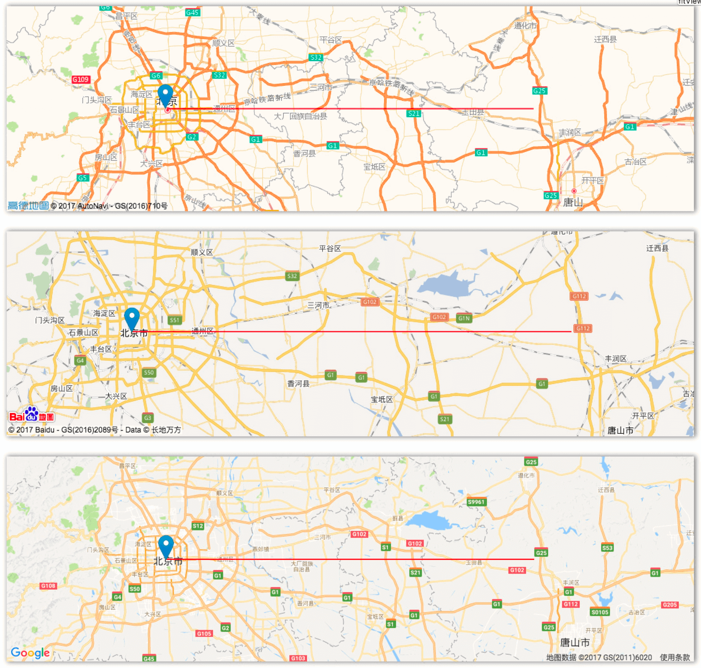

<p align="center">
    <a href="https://github.com/XingzheFE/plain">
        
        <br/>
    </a>
    </br>
    Create your map application with same code, get rid of different Map library API ✨.
</p>
<p align="center">
    <a href="https://www.npmjs.com/package/plain-js">
        
    </a>
    <a href="https://travis-ci.org/XingzheFE/plain">
        
    </a>
    <a href="https://www.npmjs.com/package/plain-js">
        
    </a>
    <a href="/Dafrok/vue-baidu-map/blob/master">
        
    </a>
</p>

<hr/>

[English](./README.md) | [简体中文](./README.zh.md)



# 特性
1. Layers
    1. Marker
    2. Polyline
    3. Popup
2. Map Controls
    1. zoom
    2. fitView
    3. panTo
3. Evented
4. Utils
    1. getBound
    2. locate
    3. coordinate translate

# 如何使用

## 安装
使用 `npm` 安装 `plain-js`，你也可以在页面中引入构建后的 `js` 文件。

`$ npm install plain-js --save`

## 创建地图
创建地图的方式很简单，最直接的方式是在 html 文件中引入地图库的脚本文件以及 `plain.min.js`
```javascript
// 首先初始化一个 plain 对象
let plain = new Plain();

// 设置需要使用的坐标系，如果不设置的话所有地图使用默认的坐标系，
// Google 和 高德地图在大陆使用 GCJ02，百度地图使用 BD09，
// 为了方便开发建议设置为 GCJ02
plain.setCoordType("GCJ02");

// 告诉 plain 你需要使用 Google 地图，
// 可选的参数有 Google Map "GMAP"， 高德地图 "AMAP"， 百度地图 "BMAP"
plain.use("GMAP");

// 创建一个 Google 地图实例
let map = plain.Map({
    container: "#map",          // DivElement
    center: [39.908012, 116.399348],
    zoom: 15
});
```
或者使用回调的方式创建
```javascript
let plain = new Plain().use("GMAP");
let key = "[your access key]";
plain.loadMap(key, () => {
    let map = window.map = plain.Map({
        container: document.getElementById("map"),
        center: [39.910, 116.404],
        zoom: 15
    });
}, err => {
    // TODO:
};

```

## 添加 Marker
```javascript
let marker = plain.Marker([39.910, 116.404]);
map.addLayer(marker);   // 也可传入一个数组
```
如果想让 Marker 变得不一样也是可以的，在 Marker 方法中传入第二个参数：
```javascript
// 自定义 icon
let icon = plain.Icon({
    url: "https://unpkg.com/leaflet@1.0.3/dist/images/marker-icon.png",
    size: [25, 40],
    anchor: [12.5, 40]
});

// Marker configure option
let markerOpt = {
    icon: icon,
    draggable: true
};
let marker2 = plain.Marker([39.910, 116.404], markerOpt);
map.addLayer(marker2);
map.removeLayer(marker);    // 可以从地图中移除之前创建的标记
```

## 添加 Polyline
向地图中添加折线之前需要先定义一个二维数组，注意：我们默认传入的坐标格式是 `[lat: Number, lng: Number]`
```javascript
let path = [
    [39.910, 116.404],
    [39.71, 116.5],
    [39.909, 117],
    [39.710, 118]
];
let polyline = plain.Polyline(path, {
    color: "#f00",
    weight: 2,
    opacity: 0.8
});
map.addLayer(polyline);
```

## 自定义覆盖物及 Popup
```javascript
let layer = plain.Layer()
    .setContent("text or Element")
    .setLatLng([31, 116])
    .mount(map)
    .show()
    .hide()
    .unmount();
let popup = plain.Popup({closeBtn: false})
    .setContent(document.createElement("button"))
    .setLatLng([31, 116])
    .mount(map)
    .show()
    .hide()
    .unmount();
```

## 事件
到目前为止，我们已经可以创建一个展示基本信息的地图了，那么接下来就给地图绑定下点击事件的响应方法。
plain 提供了一个工具方法格式化传入的事件对象，返回的值格式如下
```typescript
class Event {
    e: any;             // 原始的事件对象
    p: F.LatLng;        // 坐标 [lat: number, lng: number]
    target: F.Layer;    // 触发事件的对象
    type: string;       // 事件名
}
```
其中坐标 p 为最初 `plain.setCoordType("GCJ02");` 设置的格式，如果没有设置，那么返回的值和原生地图库一致。
```javascript
let listener = map.on("rightclick", function (e) {
    console.log(plain.Util.formatEvent.call(this, e));
    // 顺便校正下地图窗口
    map.fitView(path);
});
```
接下来我们要取消事件监听：
```javascript
map.off(listener);
```

## 工具

### Get bound

| method | description |
|---|---|
| getBound(latlngs: LatLng[]): LatLng[]| Return a rectangle that cover all points. |

### Locate

| method | description |
|---|---|
| locate(success?: Function, error?: Function): void | Map location. |

### Coordinate Translate

| method | description |
|---|---|
| b2g(latlngs: LatLng[]): LatLng[] | BD09 to GCJ02. |
| w2g(latlngs: LatLng[]): LatLng[] | WGS84 to BD09. |
| g2w(latlngs: LatLng[]): LatLng[] | GCJ02 to WGS84. |
| w2b(latlngs: LatLng[]): LatLng[] | WGS84 to BD09. |
| b2w(latlngs: LatLng[]): LatLng[] | BD09 to WGS84. |
| g2b(latlngs: LatLng[]): LatLng[] | GCJ02 to BD09. |

## License

plain is [MIT](./LICENSE) licensed..
